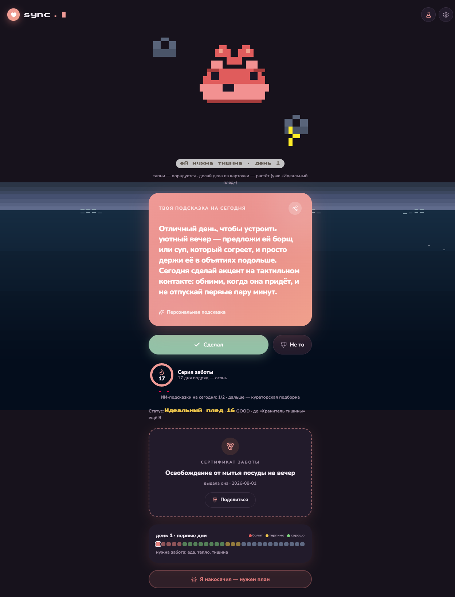
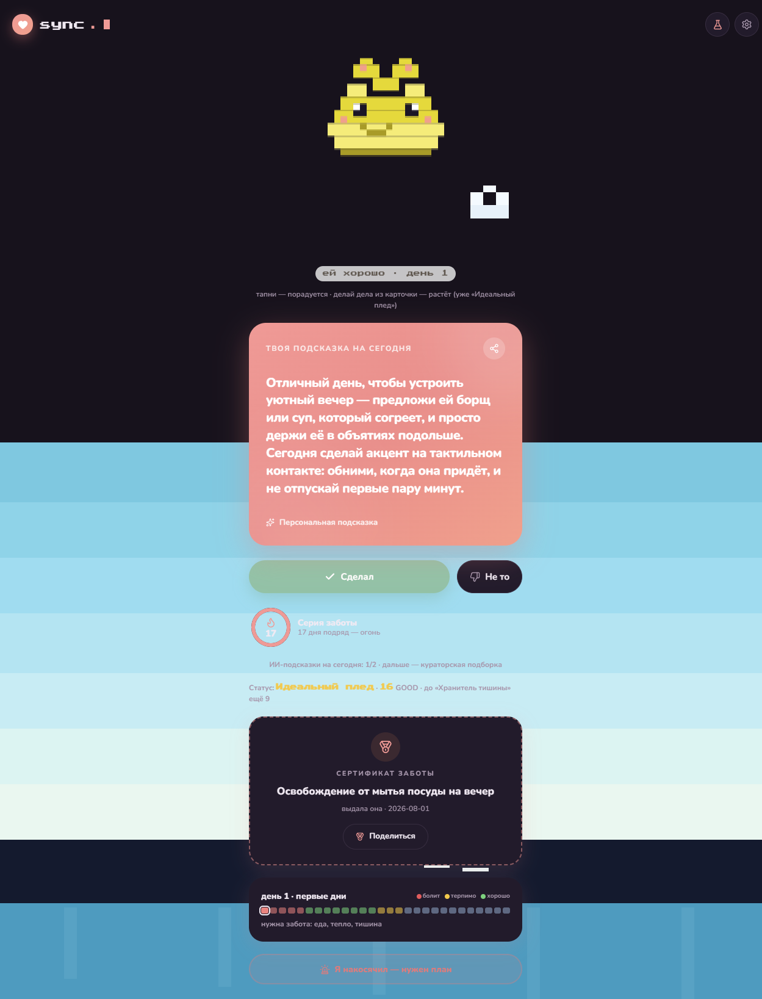
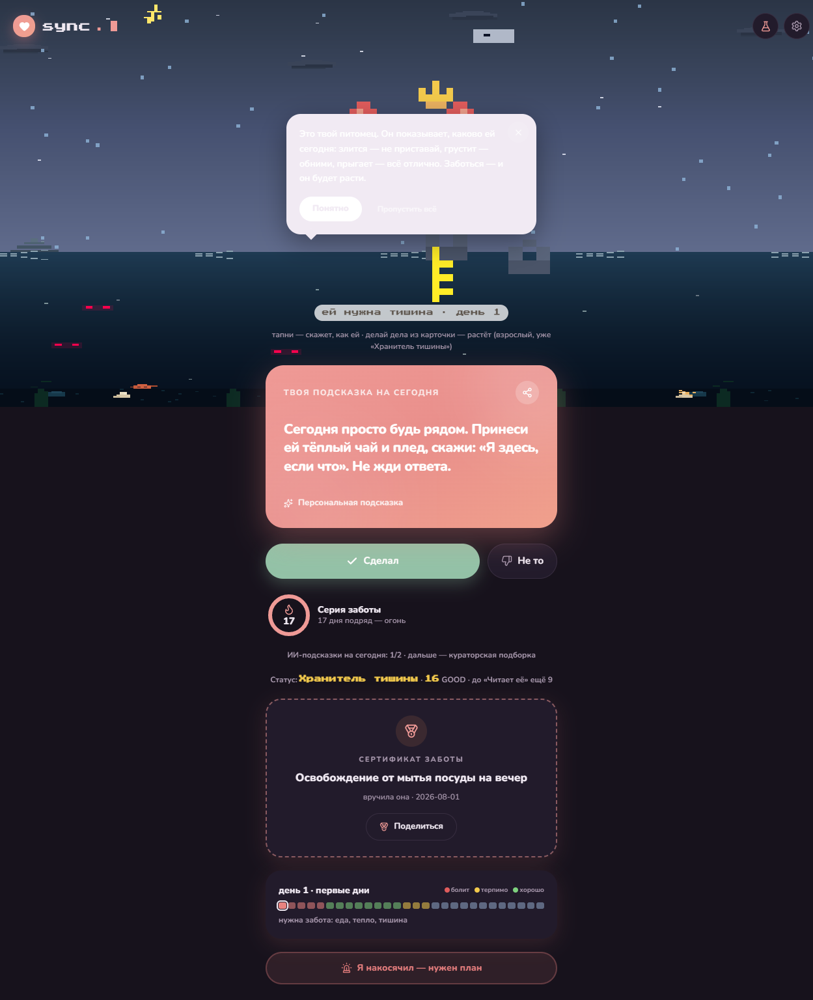
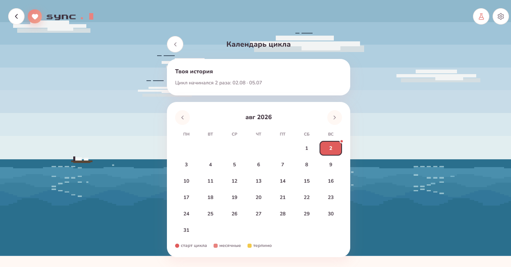

# CareMode — «переводчик эмпатии» для пар

> Она один раз описывает, как о ней заботиться. Он каждый день получает одну точную подсказку — и наконец перестаёт гадать.

**CareMode** — веб-приложение (PWA) для пар. Не трекер и не «календарь» — а переводчик: девушка объясняет один раз, что ей помогает, что бесит и какие слова работают; парень получает персонализированную карточку-подсказку каждый день и «заботится» через игру: тамагочи-маскот, перки, серии, сертификаты благодарности.

---

## ✨ Возможности

**Для неё**
- 🧭 Онбординг-«послание»: еда, пространство, слова, «что бесит», фраза-пароль, суперсила — один раз, и подсказки становятся персональными
- 💓 Пульс: «Всё бесит / Так себе / Отлично» + «Не трогать» — состояние мгновенно видно партнёру
- 📅 Навигатор цикла: день и фаза (без дат на сервере!), карусель дней с самочувствием, прогноз и история — **всё хранится только на устройстве**
- 🎁 Кэшбэк заботы: 15 реальных поступков за цикл → она вручает ему сертификат

**Для него**
- 🐣 Тамагочи-маскот: пиксельное облако с эмоциями — её состояние; растёт и эволюционирует (детёныш → подросток → взрослый) **только за реальные поступки**
- 🃏 Карточка дня: одна ИИ-подсказка (DeepSeek) или кураторская фраза; реакция GOOD/BAD обучает систему
- 📈 Перки-титулы: Стажёр → В теме → Хранитель тишины → Читает её → Тот самый
- 🆘 SOS: «Я накосячил» — срочный план: что сказать, что сделать, фраза-пароль
- 🍾 Послание: бутылка с её «шпаргалкой» — Делать / Не делать / Фраза-пароль / Суперсила

**Общее**
- 🔐 Вход: почта+пароль, Google, Яндекс
- 🔔 Web Push-уведомления («Утром / Когда встала / Вечером»)
- 🌊 Пиксельный океан: «погружение» при скролле, погода = её настроение (солнце/дождь/шторм), рыбы, дельфин, акулы, остров с пальмами, корабль
- ⚖️ Приватность: даты цикла никогда не покидают устройство; согласие на обработку ПДн (152-ФЗ); удаление аккаунта в один клик

## 📸 Скриншоты

| Погружение | Подводный мир | Тамагочи v3 | Календарь |
|---|---|---|---|
|  |  |  |  |

## 🛠 Стек

- **Next.js 16** (App Router, React 19, Tailwind 4)
- **Prisma 7 + SQLite** — 4 сущности: User, CoupleProfile, DailyPrompt, Achievement
- **NextAuth 5** (Credentials + Google + Yandex)
- **DeepSeek** (deepseek-v4-flash) — генерация карточек и SOS-планов
- **Web Push** (VAPID) — уведомления
- **Canvas 2D + framer-motion + zustand** — пиксельная графика, анимации, состояние
- **PM2 + nginx + Let's Encrypt** — продакшен

## 🚀 Быстрый старт

```bash
npm install
npx prisma migrate deploy
npm run dev        # или: npm run build && npm start
```

### Переменные окружения (.env)

```env
DATABASE_URL="file:./dev.db"
AUTH_SECRET="..."
AUTH_URL="https://caremode.ru"          # базовый URL приложения
DEEPSEEK_API_KEY="..."                  # ключ DeepSeek (ИИ-карточки)
VAPID_PUBLIC_KEY="..."                  # Web Push
VAPID_PRIVATE_KEY="..."
VAPID_SUBJECT="mailto:you@example.com"
GOOGLE_CLIENT_ID="..."                  # опционально: OAuth Google
GOOGLE_CLIENT_SECRET="..."
YANDEX_CLIENT_ID="..."                  # опционально: OAuth Яндекс
YANDEX_CLIENT_SECRET="..."
```

Все секреты — только в окружении, **в репозиторий не попадают** (см. `.gitignore`).

## 🏗 Архитектура (кратко)

```
src/
  app/(app)/today        — главный экран (роль определяет содержимое)
  app/(app)/onboarding   — «послание» (она) / микро-опрос (он)
  app/(app)/instruction  — бутылка-послание
  app/(app)/join, invite — код пары
  app/(app)/settings, calendar
  app/api/*              — REST: profile, prompt, sos, cashback, push, pair
  components/            — Tamagotchi (canvas-маскот), PixelBackground (океан),
                           DailyCard, CoachTips, DayCarousel, ...
  lib/                   — prompt'ы ИИ, кураторская библиотека, перки, цикл
```

**Принцип приватности:** история и прогноз цикла живут в localStorage устройства (`sync-device-v1`); на сервере — только фаза, настроение и день (число). Дата старта цикла на сервер не отправляется.

## 📄 Лицензия

Пока закрытая — проект в стадии подготовки к запуску. По вопросам: [откройте issue](https://github.com/koshechkintimur-a11y/caremode/issues).
